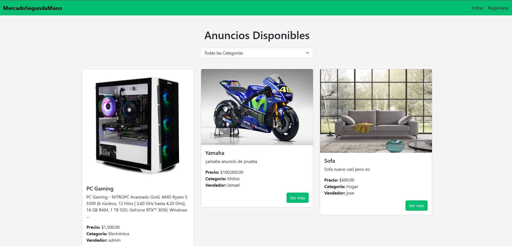
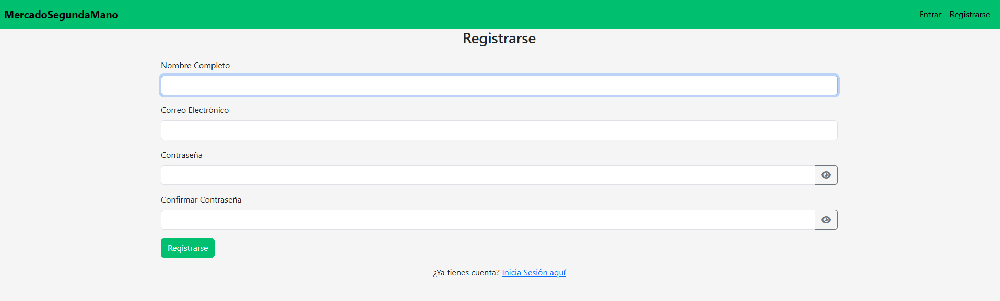
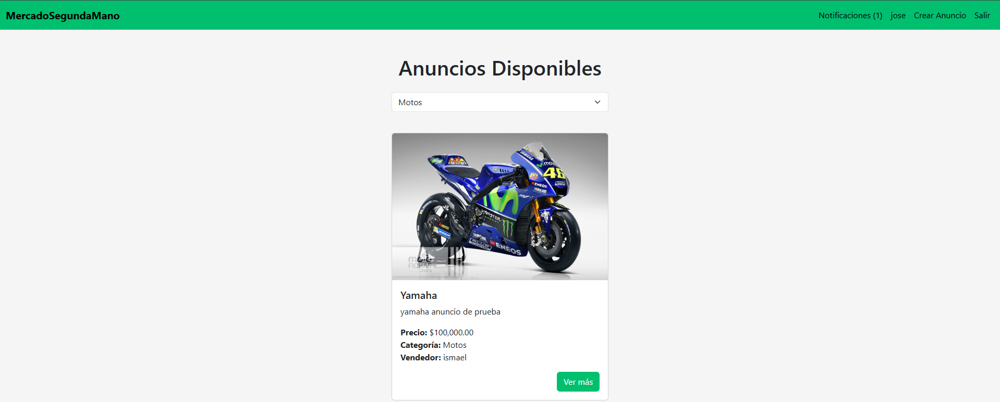
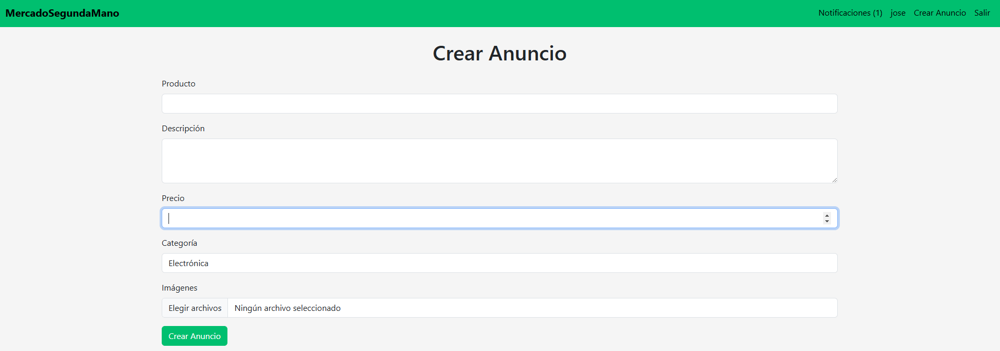

# MercadoSegundaMano

MercadoSegundaMano es una aplicación web desarrollada en Laravel que permite a los usuarios comprar y vender artículos de segunda mano. Los usuarios pueden registrarse, iniciar sesión, crear anuncios, ver anuncios disponibles, y comprar artículos.

## Requisitos

- PHP >= 8.1
- Composer
- MySQL

## Instalación

1. Clona el repositorio:

    ```sh
    git clone https://github.com/IsmaelManz26/WallapopAppLaravel.git
    cd mercadoSegundaMano
    ```

2. Instala las dependencias de PHP:

    ```sh
    composer install
    ```

3. Instala las dependencias de Node.js:

    ```sh
    npm install
    ```

4. Copia el archivo de configuración de entorno y configura tus variables de entorno:

    ```sh
    cp .env.example .env
    ```

5. Genera la clave de la aplicación:

    ```sh
    php artisan key:generate
    ```

6. Configura la base de datos en el archivo [.env](http://_vscodecontentref_/1):

    ```env
    DB_CONNECTION=mysql
    DB_HOST=127.0.0.1
    DB_PORT=3306
    DB_DATABASE=nombre_de_tu_base_de_datos
    DB_USERNAME=tu_usuario
    DB_PASSWORD=tu_contraseña
    ```

7. Ejecuta las migraciones y los seeders:

    ```sh
    php artisan migrate --seed
    ```

8. Compila los assets de frontend:

    ```sh
    npm run dev
    ```

9. Inicia el servidor de desarrollo:

    ```sh
    php artisan serve
    ```

## Características

- **Autenticación de usuarios**: Registro, inicio de sesión y cierre de sesión.
- **Gestión de anuncios**: Crear, editar y eliminar anuncios.
- **Compra de artículos**: Los usuarios pueden comprar artículos y marcar los anuncios como vendidos.
- **Notificaciones**: Los usuarios reciben notificaciones sobre las compras y ventas.
- **Filtros de búsqueda**: Filtrar anuncios por categoría.

## Estructura del Proyecto

- [Controllers](http://_vscodecontentref_/2): Controladores de la aplicación.
- [Models](http://_vscodecontentref_/3): Modelos de Eloquent.
- [Notifications](http://_vscodecontentref_/4): Notificaciones de la aplicación.
- [config](http://_vscodecontentref_/5): Archivos de configuración.
- [migrations](http://_vscodecontentref_/6): Migraciones de la base de datos.
- [factories](http://_vscodecontentref_/7): Fábricas de modelos para pruebas.
- [public](http://_vscodecontentref_/8): Archivos públicos (CSS, JS, imágenes).
- [views](http://_vscodecontentref_/9): Vistas de Blade.
- [routes](http://_vscodecontentref_/10): Archivos de rutas.
- [storage](http://_vscodecontentref_/11): Archivos generados por la aplicación (logs, caché).
- [tests](http://_vscodecontentref_/12): Pruebas unitarias y funcionales.

## Contribución

Si deseas contribuir a este proyecto, por favor sigue los siguientes pasos:

1. Haz un fork del repositorio.
2. Crea una nueva rama (`git checkout -b feature/nueva-caracteristica`).
3. Realiza tus cambios y haz commit (`git commit -am 'Agrega nueva característica'`).
4. Sube tus cambios a tu fork (`git push origin feature/nueva-caracteristica`).
5. Abre un Pull Request en el repositorio original.

## Licencia

Este proyecto está licenciado bajo la Licencia MIT. Consulta el archivo LICENSE para más detalles.

## Contacto

Si tienes alguna pregunta o sugerencia, no dudes en contactarme a través de [imanrei343@ieszaidinvergeles.org](mailto:imanrei343@ieszaidinvergeles.org).

## Capturas de Pantalla

A continuación se presentan algunas capturas de pantalla de la aplicación:

### Página de Inicio


### Registro de Usuario


### Lista de Anuncios


### Detalle del Anuncio


### Crear Anuncio
